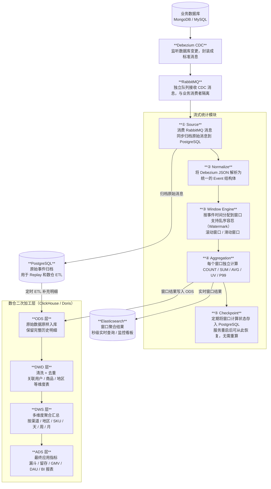
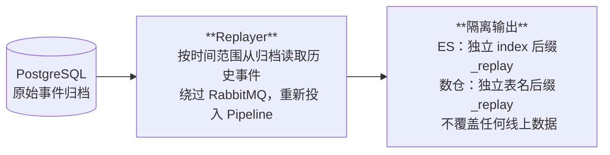

# 离线流式统计计算模块 — 架构概览

**版本：** v1.2　　**日期：** 2026-03-09

---

## 整体数据流

---

## Replay（历史重算）

---

## 组件一览

| 组件 | 职责 |
|------|------|
| **Debezium CDC** | 监听业务数据库变更，产生标准化消息 |
| **RabbitMQ** | 消息队列，独立队列保证与业务隔离 |
| **Source** | 消费 MQ 消息，归档原始数据，投递到处理管道 |
| **Normalize** | 解析 Debezium 格式，输出统一 Event 结构 |
| **Window Engine** | 按事件时间分窗口，处理乱序，触发计算 |
| **Aggregation** | 在每个窗口内计算 COUNT / SUM / AVG / UV / P99 |
| **Checkpoint** | 定期保存计算状态到 PG，支持故障恢复 |
| **Elasticsearch** | 存储窗口结果，供实时监控 / 看板查询 |
| **PostgreSQL 归档** | 存储原始事件，同时作为 Replay 和数仓 ETL 的数据来源 |
| **数仓 ODS 层** | 原始数据贴源入库，保留完整明细 |
| **数仓 DWD 层** | 清洗去重，关联用户 / 商品 / 地区维度表 |
| **数仓 DWS 层** | 多维度聚合汇总宽表 |
| **数仓 ADS 层** | 最终业务指标，对接 BI 报表 / 对外 API |
| **Replayer** | 从归档读取历史数据，重走计算流程，结果写入隔离存储 |
