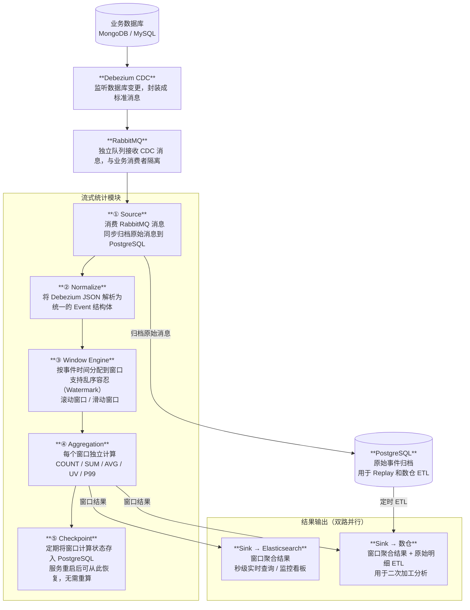
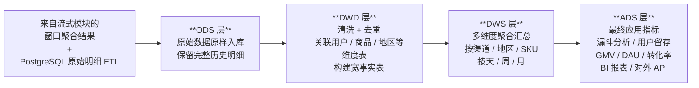
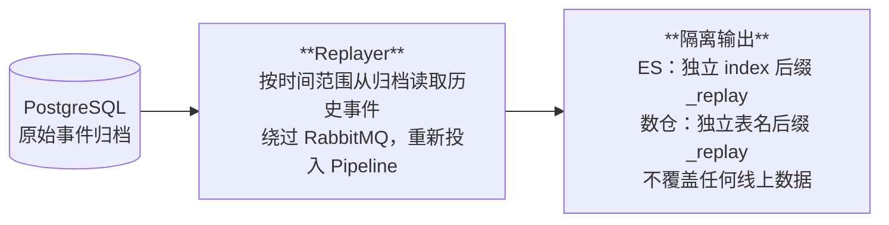

# 离线流式统计计算模块 — 架构概览

**版本：** v1.1　　**日期：** 2026-03-09

---

## 整体数据流

---

## 数仓二次加工层

---

## Replay（历史重算）

---

## 组件一览

| 组件 | 职责 |
|------|------|
| **Debezium CDC** | 监听业务数据库变更，产生标准化消息 |
| **RabbitMQ** | 消息队列，独立队列保证与业务隔离 |
| **Source** | 消费 MQ 消息，归档原始数据，投递到处理管道 |
| **Normalize** | 解析 Debezium 格式，输出统一 Event 结构 |
| **Window Engine** | 按事件时间分窗口，处理乱序，触发计算 |
| **Aggregation** | 在每个窗口内计算 COUNT / SUM / AVG / UV / P99 |
| **Checkpoint** | 定期保存计算状态到 PG，支持故障恢复 |
| **Sink ES** | 将窗口结果写入 ES，供实时监控使用 |
| **Sink DW** | 将窗口结果写入数仓 ODS 层，供二次加工 |
| **PostgreSQL 归档** | 存储原始事件，同时作为 Replay 和数仓 ETL 的数据来源 |
| **数仓 ODS→ADS** | 原始贴源→清洗关联→多维汇总→最终指标，支持复杂分析 |
| **Replayer** | 从归档读取历史数据，重走计算流程，结果写入隔离存储 |
