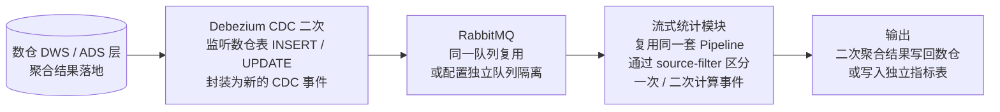
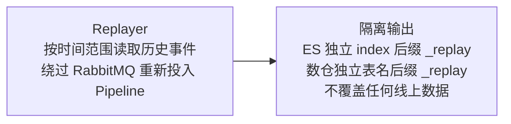

# 离线流式统计计算模块 — 架构概览

**版本：** v1.3　　**日期：** 2026-03-09

---

## 整体数据流

```mermaid
%%{init: {"flowchart": {"defaultRenderer": "elk"}}}%%
flowchart LR
    DB[("业务数据库<br/>MongoDB / MySQL")]
    DBZ1["Debezium CDC 一次<br/>监听数据库变更"]
    MQ["RabbitMQ<br/>独立队列隔离"]
    DBZ2["Debezium CDC 二次<br/>监听数仓变更<br/>触发二次流式计算"]
    ES["Elasticsearch<br/>查询数仓数据<br/>全文检索 / 监控看板"]

    DB --> DBZ1 --> MQ

    subgraph STREAM["流式统计模块"]
        direction TB
        A["① Source<br/>消费 MQ 消息"]
        B["② Normalize<br/>解析为统一 Event 结构"]
        C["③ Window Engine<br/>窗口分配 + 乱序容忍"]
        D["④ Aggregation<br/>COUNT / SUM / AVG / UV / P99"]
        A --> B --> C --> D
    end

    subgraph DW["数仓加工层"]
        direction TB
        ODS["ODS 层<br/>原始数据原样入库"]
        DWD["DWD 层<br/>清洗 + 关联维度表"]
        DWS["DWS 层<br/>多维度聚合汇总宽表"]
        ADS["ADS 层<br/>漏斗 / 留存 / GMV / BI 报表"]
        ODS --> DWD --> DWS --> ADS
    end

    MQ --> A
    D -- "窗口结果写入" --> ODS
    ADS -- "数据同步" --> ES
    DWS --> DBZ2
    DBZ2 -- "二次计算事件" --> MQ
```

---

## 二次计算说明

数仓数据落地后，由 Debezium 监听数仓表变更，重新投入同一套流式计算模块，实现数据的迭代加工：

---

## Replay（历史重算）

---

## 组件一览

| 组件 | 职责 |
|------|------|
| **Debezium CDC（一次）** | 监听业务数据库变更，产生标准化消息 |
| **Debezium CDC（二次）** | 监听数仓表变更，触发二次流式计算 |
| **RabbitMQ** | 消息队列，独立队列保证与业务隔离 |
| **Source** | 消费 MQ 消息，投递到处理管道 |
| **Normalize** | 解析 Debezium 格式，输出统一 Event 结构 |
| **Window Engine** | 按事件时间分窗口，处理乱序，触发计算 |
| **Aggregation** | 在每个窗口内计算 COUNT / SUM / AVG / UV / P99 |
| **Checkpoint** | 定期保存计算状态到 PG，支持故障恢复 |
| **数仓 ODS 层** | 原始数据贴源入库，保留完整明细 |
| **数仓 DWD 层** | 清洗去重，关联用户 / 商品 / 地区维度表 |
| **数仓 DWS 层** | 多维度聚合汇总宽表，同时作为二次计算的数据源 |
| **数仓 ADS 层** | 最终业务指标，数据同步至 ES 供查询 |
| **Elasticsearch** | 索引数仓 ADS 层数据，提供全文检索 / 监控看板 |
| **Replayer** | 读取历史数据，重走计算流程，结果写入隔离存储 |
